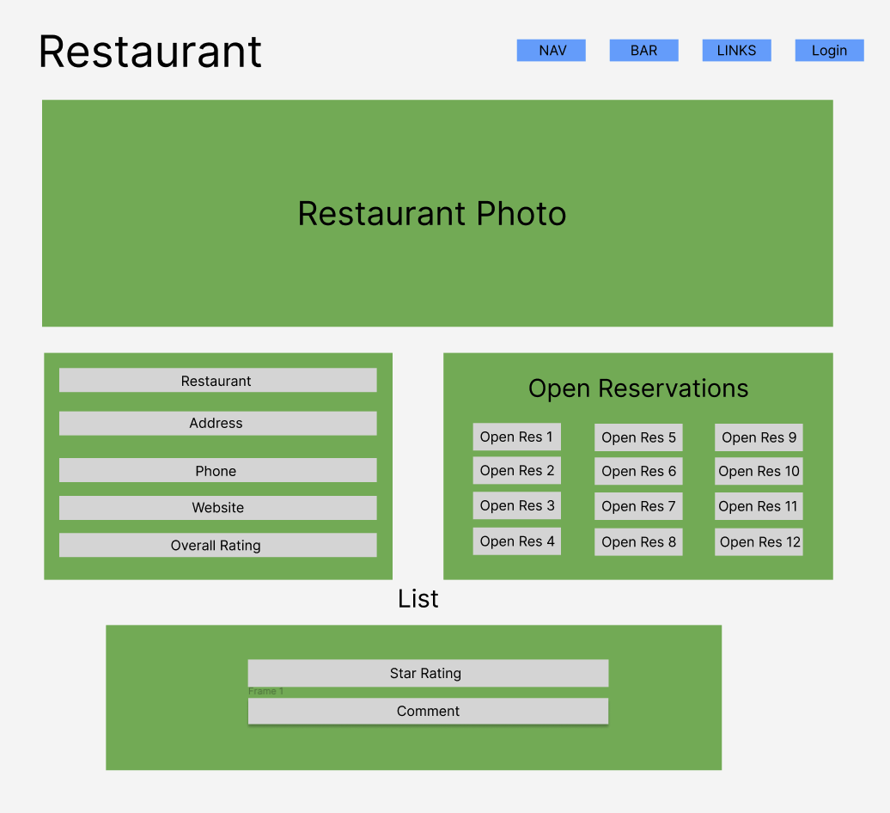
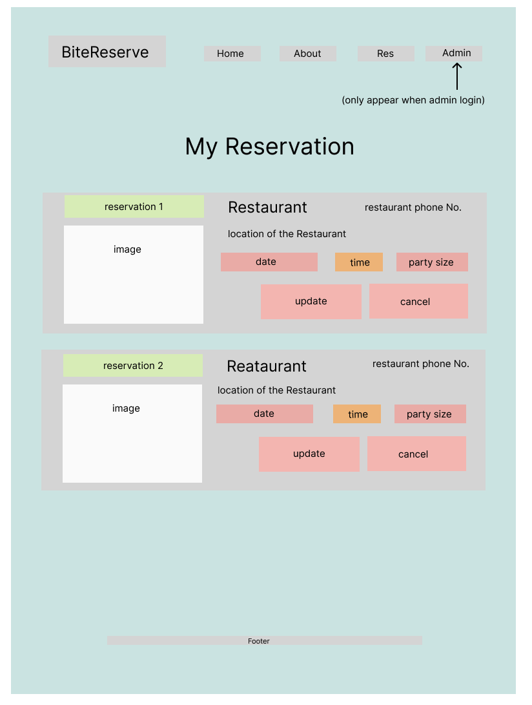
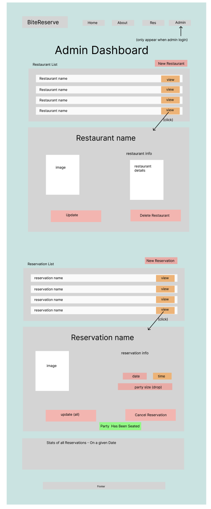
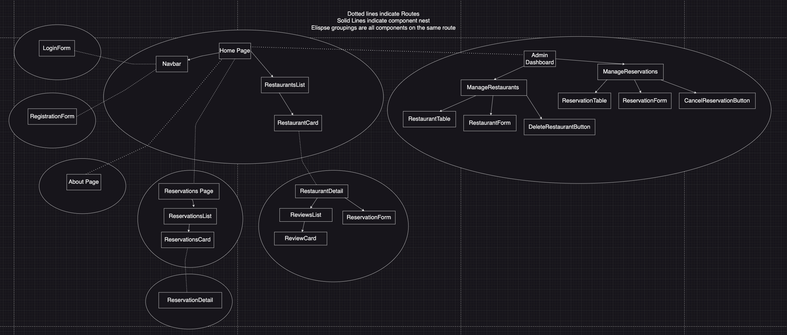
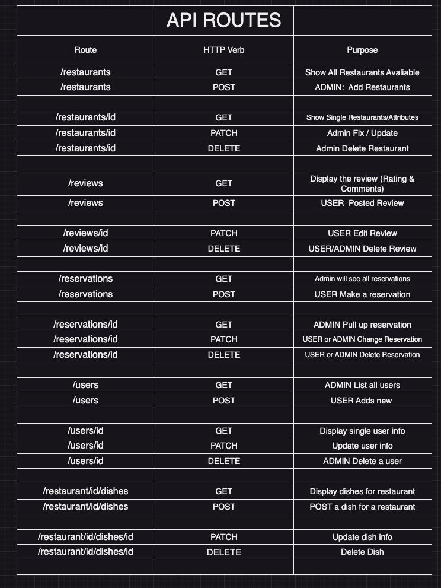
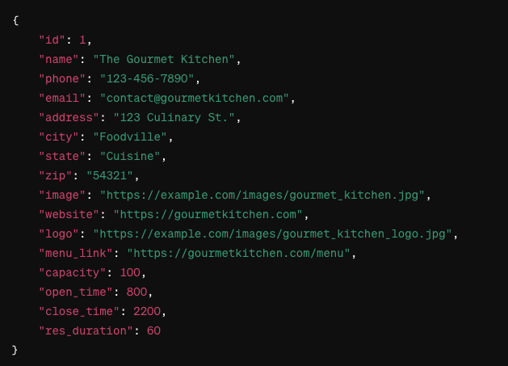
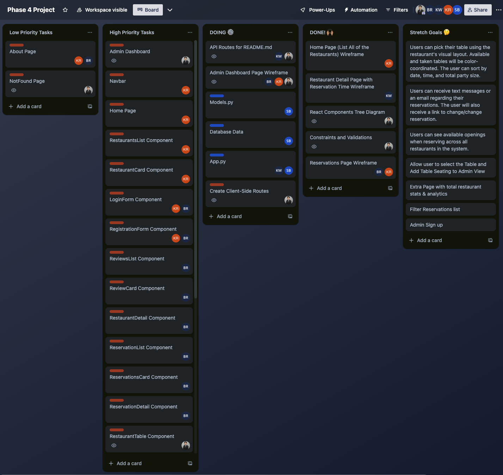

# BiteReserve

<!-- Headings -->

## Description

BiteReserve is an intuitive web application that simplifies restaurant reservations by allowing users to seamlessly browse, book, and manage their dining experiences online.

## Prerequisites

Before you begin, ensure you have met the following requirements:

- You have installed [Git](https://git-scm.com/).
- You have a [GitHub](https://github.com/) account.
- You have installed [Node.js](https://nodejs.org/) and [npm](https://www.npmjs.com/get-npm).
- You have installed [Python](https://www.python.org/) and [pipenv](https://pipenv.pypa.io/en/latest/).
- You have installed [Honcho](https://honcho.readthedocs.io/en/latest/) (to manage Procfile-based applications).

## Getting Started

To get a local copy up and running, follow these steps.

### Front-end Installation

1. Clone the repository:

   ```bash
   git clone git@github.com:your-username/bite-reserve.git
   ```

2. Navigate to the root directory:

   ```bash
   cd bite-reserve
   ```

3. Install npm packages:

   ```bash
   npm install
   ```

4. Navigate to the front-end directory:

   ```bash
   cd client
   ```

5. Install npm packages:

   ```bash
   npm install
   ```

### Back-end Installation

1. Ensure you are in the root directory of the project.

2. Install pipenv and dependencies:

   ```bash
   pipenv install
   ```

3. Activate the virtual environment:

   ```bash
   pipenv shell
   ```

## Running the Application

1. Ensure you are in the root directory of the project.

2. Start the application using Honcho:

   ```bash
   honcho start -f Procfile.dev
   ```

## Wireframe

### Home Page


### Restaurant Detail Page



### Reservations Page



### Admin Dashboard Page



## User Stories

1. Users can see a list of restaurants on the homepage. When users click on one of the restaurants, they are redirected to view more details about the restaurant. Here, they can book a reservation, leave a rating, and comment on the restaurant.

2. Users must log in to the website to book a reservation, leave a rating, and comment.

3. Users can view info about the site on the “About” page.

4. Users can log into the website to make a reservation at a restaurant with a unique username and password.

5. Users can register on the website, where they set up a username and password and will be prompted to become admin users.

6. Users can check, update, and cancel their reservations on the reservation list page when they log in.

7. Admin users can manage the restaurants on the website, where they can add, edit, and delete restaurants.
8. Admin users can manage the reservations for all restaurants where they can add, edit, and delete reservations.

## React Components Tree



## Database Schema


## Constraints

- All users should have an unique usernames
- Admin users should only be allowed to edit restaurants and reservations, but not to make reservations

## Validations

- Ensure the capacity and table_size attributes in the Restaurant table are integers.
- Check the phone format in the Restaurant table and email format in User table
- Restaurant name must be unique
- Restaurant capacity must be an integer
- Reservation table size must be an integer
- Reservation status must be a valid string value
- Email address must be in a valid format
- The name of the user must be non-empty
- The username and password of the user must be non-empty
- Rating must be between 1 and 5
- Review comments on a restaurant must be non-empty

## API Routes



## Example of a Response Structure

GET /restaurants



## React Routes


## Stretch Goals

1. Users can pick their table using the restaurant's visual layout. Available and taken tables will be color-coordinated. The user can sort by date, time, and total party size.

2. Users can receive text messages or an email regarding their reservations. The user will also receive a link to change/change reservation.

3. Users can see available openings when reserving across all restaurants in the system.

## Trello Board


